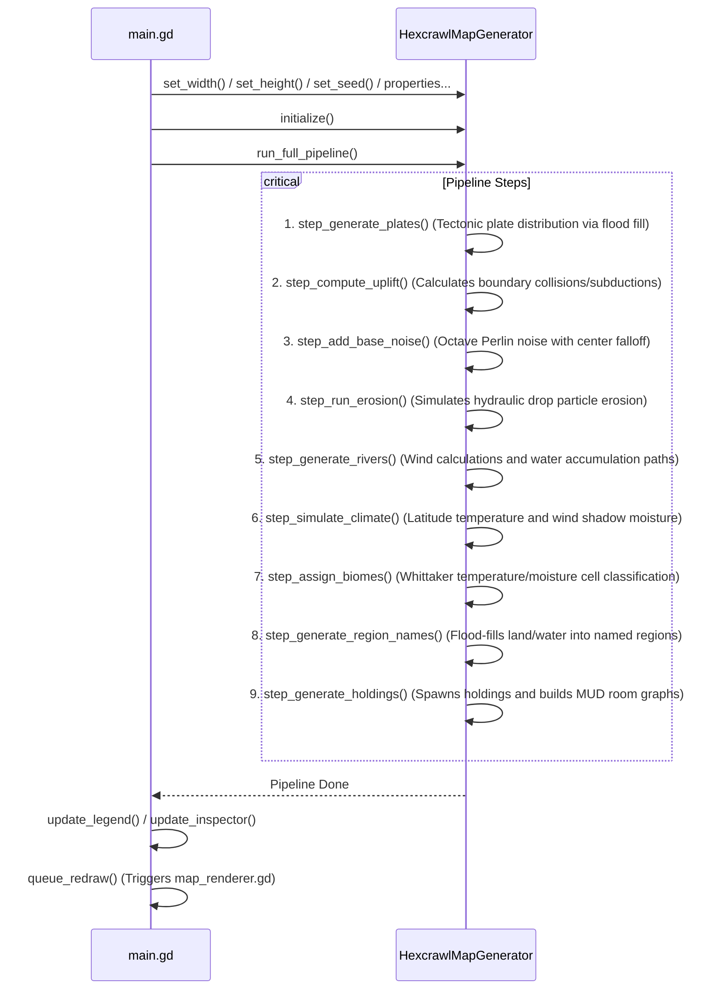

# World Sim: Codebase Knowledge Map

This document provides a comprehensive, high-level map of the files, directories, data structures, public APIs, and execution flows in the **World Sim** procedural map generator. It is designed to help both **human developers** and **agentic AI coders** immediately understand the codebase structure and how components interact.

---

## 1. Directory & File Registry

Below is the visual directory layout of the project, mapping each file to its main responsibility:

```
world-sim/
├── SConstruct                  # SCons build configuration for compiling GDExtension C++ source
├── GUARDRAIL.md                # Development rules, static initialization warnings, and compile tips
├── PROJECT_STYLE.md            # Code style guide, naming conventions, and file structure rules
├── GRAPH_KNOWLEDGE.md          # This file (architectural map, data structures, and pipeline flow)
├── HEXTILE.md                  # Comprehensive explanation of the hex grid geometry, structures, and pipeline math
├── INSTRUCTION.md              # Original instructions/workflow guidelines
│
├── src/                        # C++ GDExtension Simulation Backend
│   ├── register_types.h/.cpp   # Entrypoint. Binds & registers class types with Godot Engine
│   ├── hextile_framework.h     # Core structure definitions: HexCell, Plate, and Region
│   ├── hexcrawl_map_generator.h/.cpp # Class definition, pipeline setup, properties, and API exports
│   ├── perlin_noise.h/.cpp     # Custom Octave-based Perlin Noise implementation
│   ├── name_generator.h/.cpp   # Generates geographic labels for regions, mountains, and rivers
│   ├── map_gen_tectonics.cpp   # Steps 1 & 2: Plate distribution and boundary collision uplift
│   ├── map_gen_terrain.cpp     # Steps 3 & 4: Base noise heightmap and hydraulic erosion simulation
│   ├── map_gen_water.cpp       # Step 5: Moisture direction, flow accumulation, and river pathing
│   ├── map_gen_climate.cpp     # Step 6: Latitude temperature calculation & wind moisture shadow
│   ├── map_gen_biomes.cpp      # Step 7: Whittaker temperature/moisture classification for biomes
│   ├── map_gen_regions.cpp     # Step 8: Grouping tiles into labeled geopolitical/geological regions
│   └── map_gen_holdings.cpp    # Step 9: Spawns CK2-style holdings and MUD room graphs
│
└── demo/                       # Godot Presentation Frontend
    ├── project.godot           # Godot project settings
    ├── main.tscn               # Core UI layout (sliders, buttons, legend panel, inspector, camera)
    ├── main.gd                 # UI event handling, controller linking UI values to C++ generator
    ├── map_renderer.gd         # Low-level 2D canvas drawing script (renders cells, rivers, overlays)
    ├── camera_controller.gd    # Handles panning (mouse drag) and focal zoom (mouse wheel)
    └── bin/                    # Compiled DLL/SO files and gdextension configuration
        └── world_sim.gdextension  # Configuration file matching operating systems to GDExtension DLLs
```

---

## 2. Architecture & Data Flow

The project is split into a **C++ Simulation Layer** (optimized for mathematical processing and procedural logic) and a **GDScript UI/Render Layer** (optimized for presentation and interaction).

```mermaid
graph TD
    subgraph GDScript (Presentation Layer)
        main_tscn["main.tscn (Scene Tree)"]
        main_gd["main.gd (UI Controller)"]
        map_renderer_gd["map_renderer.gd (Redraw Grid)"]
        camera_gd["camera_controller.gd (Pan/Zoom)"]
    end

    subgraph C++ GDExtension (Simulation Backend)
        reg_types["register_types.cpp (GDExtension Entrypoint)"]
        generator["HexcrawlMapGenerator (ClassDB API)"]
        perlin["PerlinNoise (Terrain elevation)"]
        name_gen["NameGenerator (Procedural Names)"]
        framework["hextile_framework.h (Core Structs)"]
    end

    %% Interactions
    main_tscn --> main_gd
    main_gd -->|Instantiates & Configures| generator
    main_gd -->|Translates Camera| camera_gd
    map_renderer_gd -->|Fetches cell coordinates, biomes & elevations| generator
    
    generator -->|Exposed via ClassDB| reg_types
    generator -->|Uses| framework
    generator -->|Uses| perlin
    generator -->|Uses| name_gen
```

---

## 3. Core Data Structures (`src/hextile_framework.h`)

All simulation data is defined in [hextile_framework.h](file:///d:/world-sim/src/hextile_framework.h) and shared internally via flat standard C++ vectors.

### A. `Plate`
Represents a tectonic plate.
* `int id`: Unique plate ID.
* `Vector2 velocity`: Movement vector that dictates convergent (colliding) or divergent (separating) boundaries.

### B. `Region`
Represents a clustered geological or political geographic region.
* `int id`: Unique region ID.
* `String name`: Procedurally generated name (e.g. *"Eldoria Desert"*).
* `String type`: Categorization (`"continent"`, `"island"`, `"biome_region"`, `"micro_region"`, `"mountain_range"`, `"river"`).
* `std::vector<int> cell_indices`: List of indices of `HexCell`s belonging to this region.
* `Vector2 center_position`: Average coordinates of the region's cells.

### C. `HexCell`
The basic unit of the map grid.
* **Spatial Info**: `int index`, `int x`, `int y` (grid column and row coordinates).
* **Tectonic Info**: `int plate_id`, `float uplift` (elevation added by colliding plates).
* **Terrain Info**: `float elevation` (final combined height), `float noise_val` (base noise height).
* **Climate Info**: `float temperature` (elevation/latitude based), `float moisture` (wind/rain shadow based).
* **Hydrology Info**: `float water_accumulation` (river volume), `int river_next_idx` (downstream cell index), `bool is_river`.
* **Geopolitical/Region IDs**: `landmass_id`, `biome_region_id`, `micro_region_id`, `mountain_range_id`, `river_id`.
* **Overlays**: `String overlay` (e.g. `"none"`, `"ruins"`, `"castle"`).
* **Holdings**: `holding_ids[5]` (global holding IDs), `holding_count` (number of local holdings).

### D. `SubArea`
A granular, text-RPG room within a holding.
* `int local_id`: Local ID within the holding.
* `std::string name`: Room presentation name.
* `std::string description`: Text-RPG description string.
* `uint64_t tags`: Bitmask simulation flags (e.g. `Raidable`, `Burnable`, `Lootable`, `Underground`).
* `int exits[8]`: Direction links to other `local_id`s.

### E. `Holding`
A microscopic anchor on a hex cell representing a settlement or site.
* `int id`: Global unique ID.
* `int parent_hex_idx`: Reference to parent `HexCell`.
* `HoldingType type`: Enum representing type (`Wilderness`, `Fortress`, `InlandSettlement`, etc.).
* `std::string name`: Settlement name.
* `uint64_t tags`: Bitmask simulation flags.
* `std::vector<SubArea> sub_areas`: Room graph.

---

## 4. Public GDExtension API (`HexcrawlMapGenerator`)

The C++ generator exposes properties and methods to Godot's `ClassDB`, making them accessible directly in GDScript.

### Core Methods
* `initialize(width, height, seed)`: Resizes cell grids and resets tectonic plates and RNG.
* `run_full_pipeline()`: Triggers all 8 generator steps in sequence.
* `step_generation(step_index)`: Run a specific step of the generator (0 to 7) for step-by-step rendering.
* `get_neighbors(idx)`: Returns a `PackedInt32Array` of adjacent cell indices (1-hop neighbors).
* `get_cell_position(idx)`: Calculates the 2D world-space coordinates of a hex cell.
* `get_cell_data(idx)`: Returns a `Dictionary` of all properties of a specific cell (used in the UI Inspector, now includes holdings info).
* `get_river_paths()`: Returns an array of polylines representing active river routes.
* `get_holding_data(holding_id)`: Returns a `Dictionary` of holding configuration, tags, and MUD sub-areas.
* `enter_holding(holding_id)` / `exit_holding()`: Sets or clears active player session.
* `move_player_dir(dir_val)`: Moves player through room exits.
* `get_player_current_room_data()`: Returns details of the player's current location.

### Bulk Data Getters (Optimized for Rendering)
Instead of querying cells one-by-one, GDScript queries data in bulk:
* `get_elevations()` -> `PackedFloat32Array`
* `get_moistures()` -> `PackedFloat32Array`
* `get_temperatures()` -> `PackedFloat32Array`
* `get_biomes()` -> `PackedInt32Array`
* `get_plates()` -> `PackedInt32Array`
* `get_overlays()` -> `PackedStringArray`

---

## 5. Pipeline Execution Flow

When generating a map, `HexcrawlMapGenerator::run_full_pipeline()` executes steps sequentially:



---

## 6. Build & Compilation Workflow

### Compilation
Ensure the Godot editor and game instances are closed (releasing file locks on the GDExtension DLLs) before building:
```powershell
# Compile debug target (development/testing)
python -m SCons -j4 platform=windows target=template_debug

# Compile release target (production/optimized)
python -m SCons -j4 platform=windows target=template_release
```

### Verification
Run Godot headlessly to verify that the GDExtension loader correctly registers class mappings without any crashes or initialization errors (e.g. Windows Error 1114):
```powershell
.\Godot_v4.4.1-stable_win64.exe --path demo --headless --quit --verbose
```
