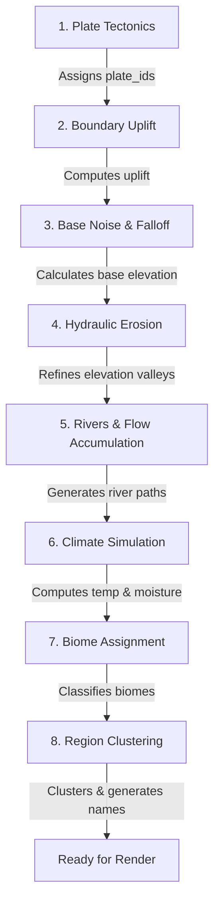

# Hextile Map Generation & Grid Framework

This document explains the **Hextile** grid system and how it serves as the foundation for the procedural world simulation in this project. It details the coordinate mathematics, data structures, and how each step of the map generation pipeline manipulates the grid to produce realistic continents, climates, rivers, and biomes.

---

## 1. Grid Geometry & Coordinate System

The map is represented as a 2D grid of **pointy-topped hexagons** organized in an **odd-row offset layout** (often referred to as `"odd-r"` or `"shove-right"`).

```
    Even Row (y = 0)      [0,0]     [1,0]     [2,0]     [3,0]
                           \       /   \       /   \       /
    Odd Row (y = 1)         [0,1]     [1,1]     [2,1]     [3,1]
```

### A. Coordinate Mapping
Every hex cell in the grid is identified by a unique 1D flat array index `i`.
* **1D Index to 2D Grid Coordinates $(x, y)$**:
  \[
  x = i \pmod{\text{width}}
  \]
  \[
  y = \lfloor i / \text{width} \rfloor
  \]
* **2D Grid Coordinates $(x, y)$ to 1D Index `i`**:
  \[
  i = y \times \text{width} + x
  \]

### B. World Space Position calculation
To render the cells on a 2D screen or calculate spatial distances, the grid coordinates $(x, y)$ are projected into a continuous 2D Cartesian space $(px, py)$ using the following equations:
* **Horizontal Offset**: Odd rows ($y$ is odd) are shifted right by half a cell spacing.
  \[
  px = x + \begin{cases} 0.5 & \text{if } y \text{ is odd} \\ 0.0 & \text{if } y \text{ is even} \end{cases}
  \]
* **Vertical Spacing**: Pointy-topped hex rows are spaced vertically by $\frac{\sqrt{3}}{2} \approx 0.8660254$ times the hex size.
  \[
  py = y \times \frac{\sqrt{3}}{2}
  \]

In the C++ codebase, this is implemented in `get_cell_position()`:
```cpp
Vector2 HexcrawlMapGenerator::get_cell_position(int idx) const {
    int x = idx % width;
    int y = idx / width;
    bool is_odd = (y & 1) != 0;
    float px = (float)x + (is_odd ? 0.5f : 0.0f);
    float py = (float)y * 0.8660254f;
    return Vector2(px, py);
}
```

### C. Hexagonal Neighbors Lookup
Because of the offset layout, finding adjacent neighbors depends on whether the current row index $y$ is even or odd:

* **Adjacent columns (always neighbors)**:
  * Left: $(x - 1, y)$
  * Right: $(x + 1, y)$
* **Even Rows ($y \pmod 2 = 0$)**:
  * Top-Left: $(x - 1, y - 1)$
  * Top-Right: $(x, y - 1)$
  * Bottom-Left: $(x - 1, y + 1)$
  * Bottom-Right: $(x, y + 1)$
* **Odd Rows ($y \pmod 2 = 1$)**:
  * Top-Left: $(x, y - 1)$
  * Top-Right: $(x + 1, y - 1)$
  * Bottom-Left: $(x, y + 1)$
  * Bottom-Right: $(x + 1, y + 1)$

---

## 2. Core Data Structures ([hextile_framework.h](file:///d:/world-sim/src/hextile_framework.h))

The state of the map is stored in flat vectors of C++ structures. The main structures are [HexCell](file:///d:/world-sim/src/hextile_framework.h#L23), [Plate](file:///d:/world-sim/src/hextile_framework.h#L10), and [Region](file:///d:/world-sim/src/hextile_framework.h#L15).

### A. [HexCell](file:///d:/world-sim/src/hextile_framework.h#L23)
The fundamental unit of the map. It holds physical, geological, climatological, and administrative attributes.

| Field Name | Type | Description |
| :--- | :--- | :--- |
| `index` | `int` | Flat 1D index of the cell in the array. |
| `x, y` | `int` | Column and row grid coordinates. |
| `plate_id` | `int` | ID of the tectonic plate this cell belongs to. |
| `elevation` | `float` | Final height of the cell (range: $[-0.2, 1.2]$). Values above `ocean_level` represent land. |
| `uplift` | `float` | Mountain-building forces generated by tectonic boundary collisions. |
| `noise_val` | `float` | Local elevation variation generated by Perlin noise. |
| `temperature` | `float` | Normalized heat index (range: $[0.0, 1.0]$), affected by latitude ($y$) and altitude. |
| `moisture` | `float` | Normalized humidity (range: $[0.05, 1.0]$), affected by oceans and rain shadows. |
| `water_accumulation` | `float` | Accumulation of flow draining down slopes (used to determine river paths). |
| `river_next_idx` | `int` | Index of the downhill cell to which water flows ($-1$ if none / end of river). |
| `is_river` | `bool` | True if the cell's `water_accumulation` exceeds the river threshold. |
| `landmass_id` | `int` | Region ID of the continent/island this cell belongs to ($-1$ if ocean). |
| `biome_region_id` | `int` | Region ID of the contiguous biome this cell belongs to. |
| `micro_region_id` | `int` | Region ID of small land segments ($< 5$ cells). |
| `mountain_range_id` | `int` | Region ID of the mountain range this cell belongs to. |
| `river_id` | `int` | Region ID of the river system traversing this cell. |
| `overlay` | `String` | Visual symbol overlays (`"none"`, `"hill"`, `"low_mountain"`, `"high_mountain"`). |

### B. [Plate](file:///d:/world-sim/src/hextile_framework.h#L10)
Represents a tectonic plate that moves across the map.

| Field Name | Type | Description |
| :--- | :--- | :--- |
| `id` | `int` | Unique identifier. |
| `velocity` | `Vector2` | Direction and speed of the plate's movement. |

### C. [Region](file:///d:/world-sim/src/hextile_framework.h#L15)
Represents a clustered, contiguous group of cells forming a geographic feature.

| Field Name | Type | Description |
| :--- | :--- | :--- |
| `id` | `int` | Unique identifier. |
| `name` | `String` | Procedurally generated name (e.g. *"Eldoria Desert"*). |
| `type` | `String` | Categorization: `"continent"`, `"island"`, `"biome_region"`, `"micro_region"`, `"mountain_range"`, or `"river"`. |
| `cell_indices` | `std::vector<int>` | List of indices of `HexCell`s belonging to this region. |
| `center_position` | `Vector2` | Center-of-mass coordinate calculated as the average coordinate of all member cells. |

---

## 3. The Map Generation Pipeline

The map is built in 8 sequential steps. Each step computes and populates fields within the [HexCell](file:///d:/world-sim/src/hextile_framework.h#L23) structure.



### Step 1: Plate Tectonics (`step_generate_plates` in [map_gen_tectonics.cpp](file:///d:/world-sim/src/map_gen_tectonics.cpp#L7))
* **Objective**: Define plate boundaries and tectonic directions.
* **Mechanism**:
  1. Spawns $N$ tectonic plates at random cell indices.
  2. Assigns each plate a random 2D velocity vector.
  3. Uses a Breadth-First Search (BFS) flood fill to expand plate boundaries outward until all cells are assigned a `plate_id`.

### Step 2: Boundary Uplift (`step_compute_uplift` in [map_gen_tectonics.cpp](file:///d:/world-sim/src/map_gen_tectonics.cpp#L48))
* **Objective**: Model mountain building (orogenesis) and deep depressions.
* **Mechanism**:
  1. Identifies boundary cells (cells adjacent to a cell of a different plate).
  2. Projects the relative velocity between the two plates onto the normal vector between their centroids.
  3. Classifies boundary interaction:
     * **Convergence** ($\text{dot} > 0.15$): Plates collide, generating significant positive `uplift`.
     * **Divergence** ($\text{dot} < -0.15$): Plates separate, generating negative `uplift` (rifts/depressions).
     * **Shear/Transform** ($|\text{dot}| \le 0.15$): Plates slide past each other, generating moderate `uplift`.
  4. Propagates the uplift value inland using a BFS queue with an `uplift_decay` multiplier per step.

### Step 3: Base Noise & Distance Falloff (`step_add_base_noise` in [map_gen_terrain.cpp](file:///d:/world-sim/src/map_gen_terrain.cpp#L11))
* **Objective**: Create local variation (hills/plains) and guarantee an island/continent structure.
* **Mechanism**:
  1. Generates multi-octave Perlin noise values for every cell (`noise_val`).
  2. Computes the Euclidean distance from each cell to the center of the map.
  3. Applies a cubic distance-based falloff formula to lower elevations toward the map boundaries:
     \[
     \text{falloff} = 1.0 - \left(\frac{\text{distance}}{\text{max\_dist}}\right)^3
     \]
  4. Combines noise, tectonic uplift, and falloff to write the final initial `elevation`:
     \[
     \text{elevation} = (\text{uplift} + \text{noise\_val} + 0.12) \times \text{falloff} - 0.12
     \]

### Step 4: Hydraulic Erosion (`step_run_erosion` in [map_gen_terrain.cpp](file:///d:/world-sim/src/map_gen_terrain.cpp#L37))
* **Objective**: Carve out natural drainage basins, valleys, and smooth out jagged noise.
* **Mechanism**:
  1. Spawns thousands of virtual rain drops on random land cells.
  2. For each step of a drop's lifetime:
     * Finds the downhill neighbor with the lowest elevation.
     * If no downhill neighbor exists, deposits its carried sediment and vanishes.
     * Calculates the sediment carrying capacity based on its speed, water volume, and local slope.
     * If carrying less than capacity, erodes the cell (lowering its `elevation`) and takes sediment.
     * If carrying more than capacity, deposits sediment (raising its `elevation`).
     * Updates speed using gravity and evaporates a fraction of its water.

### Step 5: Rivers & Flow Accumulation (`step_generate_rivers` in [map_gen_water.cpp](file:///d:/world-sim/src/map_gen_water.cpp#L6))
* **Objective**: Establish drainage networks.
* **Mechanism**:
  1. Resets `water_accumulation` to $1.0$ for all cells.
  2. Sorts all cells by `elevation` in descending order.
  3. Iterates through the sorted list, routing the cell's accumulated water to its lowest-elevation neighbor, adding to that neighbor's accumulation.
  4. Cells with land elevations ($elev \ge ocean\_level$) and `water_accumulation` exceeding `river_threshold` are marked `is_river = true`.
  5. Stores the downstream index in `river_next_idx` to trace river lines.

### Step 6: Climate Simulation (`step_simulate_climate` in [map_gen_climate.cpp](file:///d:/world-sim/src/map_gen_climate.cpp#L6))
* **Objective**: Calculate temperature zones and moisture patterns.
* **Mechanism**:
  1. **Temperature**: Based on latitude ($y$ coordinate) and altitude:
     \[
     \text{temperature} = \text{latitude\_base} - \text{lapse\_rate} \times \max(0.0, \text{elevation} - \text{ocean\_level})
     \]
  2. **Moisture & Wind**:
     * Ocean cells have a constant moisture of $1.0$.
     * Wind blows from east to west (iterating columns from right to left).
     * Moisture is gathered from oceans and carried downwind.
     * **Orographic Precipitation**: When wind encounters a slope (higher elevation than its eastern neighbor), precipitation triggers, lowering downwind moisture:
       \[
       \text{precipitation} = \text{moisture\_in} \times \text{slope} \times \text{precipitation\_factor}
       \]
     * This naturally forms wet windward slopes (rainforests) and dry leeward slopes (**rain shadows** / deserts).

### Step 7: Biome Assignment (`step_assign_biomes` in [map_gen_biomes.cpp](file:///d:/world-sim/src/map_gen_biomes.cpp#L6))
* **Objective**: Classify cells into biomes.
* **Mechanism**:
  1. Runs a flood fill from the map borders to identify water bodies. Water cells connected to the border are classified as **Ocean (0)**. Land-locked water cells are classified as **Lake (14)**.
  2. Land cells are classified using a **Whittaker Diagram** based on `temperature` ($T$) and `moisture` ($M$):

```
       Cold (T < 0.15)       -->  Moisture > 0.40 ? Tundra (3)  : Glacier/Ice (2)
       Cool (0.15 <= T < 0.35) -->  Moisture < 0.25 ? Cold Desert (5) : Taiga/Boreal (4)
       Temperate (0.35 <= T < 0.65):
                                 |-- Moisture < 0.25 : Grassland (6)
                                 |-- Moisture < 0.65 : Deciduous Forest (7)
                                 +-- Moisture >= 0.65: Temperate Rainforest (8)
       Hot (T >= 0.65)             :
                                 |-- Moisture < 0.18 : Hot Desert (9)
                                 |-- Moisture < 0.45 : Savanna (10)
                                 |-- Moisture < 0.72 : Tropical Seasonal Forest (11)
                                 +-- Moisture >= 0.72: Tropical Rainforest (12)
```

3. Cells with elevations near the ocean level are assigned as **Beach (1)** or **Lake Shore (15)**.

### Step 8: Region Clustering (`step_generate_region_names` in [map_gen_regions.cpp](file:///d:/world-sim/src/map_gen_regions.cpp#L8))
* **Objective**: Group cells into discrete named locations.
* **Mechanism**:
  1. **Landmasses**: Flood-fills contiguous land cells. Large components ($\ge 100$ cells) are labeled `"continent"`, while smaller ones are `"island"`.
  2. **Mountain Ranges**: Flood-fills contiguous high-elevation cells ($\ge 0.70$).
  3. **Biomes**: Flood-fills contiguous cells sharing the same biome ID. Small components ($< 5$ cells) are categorized as `"micro_region"`, larger ones as `"biome_region"`.
  4. **Rivers**: Traces paths from river sources to mouths.
  5. Assigns unique procedural names using prefix/suffix lists in [NameGenerator](file:///d:/world-sim/src/name_generator.h).

---

## 4. Visual Overlays & Rendering

The frontend renderer ([map_renderer.gd](file:///d:/world-sim/demo/map_renderer.gd)) queries the backend data in bulk and draws the map using Godot 2D Canvas primitives.

* **Hex Polygon Coordinates**: Drawn using six vertices calculated relative to the cell's center position:
  \[
  \text{Vertex}_k = \text{center} + \begin{pmatrix} \cos(60^\circ \times k - 30^\circ) \\ \sin(60^\circ \times k - 30^\circ) \end{pmatrix} \times \text{size}
  \]
* **Overlays**:
  * **Mountain Symbols**: Peaks with white snowcaps drawn inside cells where `overlay` is `"high_mountain"` or `"low_mountain"`.
  * **Hill Symbols**: Rounded humps drawn inside cells where `overlay` is `"hill"`.
  * **Forest Symbols**: Pine tree silhouettes drawn inside cells categorized under forested biomes (e.g. Taiga, Rainforest).
  * **Wave Symbols**: Flow ripples drawn in shallow ocean water.
  * **Rivers**: Rendered as continuous blue polylines tracing cell centers from source to mouth.
